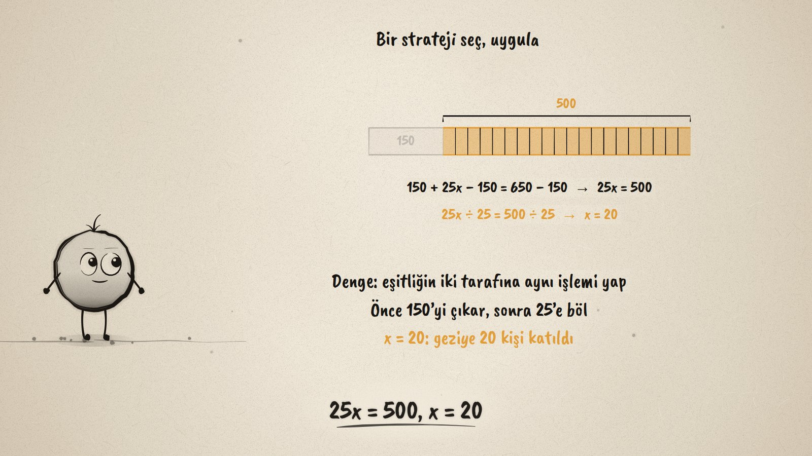
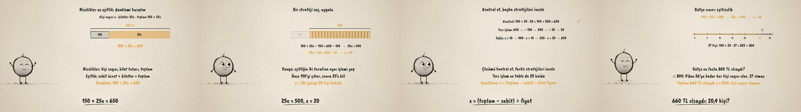

# Kaç Kişi Gitti? · Equations and Inequalities

**▶ Tarayıcıda izleyin / Watch in the browser:** https://hakanatas.github.io/kac-kisi-gitti/ 
**⬇ MP4 + altyazılar / MP4 + subtitles:** [Releases](https://github.com/hakanatas/kac-kisi-gitti/releases) 
**✎ Kullanılan istem / The prompt behind it:** [PROMPT.md](PROMPT.md) 
**🎞 Bütün filmler / All films:** [Nokta'nın Filmleri](https://hakanatas.github.io/nokta-filmleri/?sinif=7)

> **TR —** 7. sınıf matematik "İşlemlerle Cebirsel Düşünme ve Değişimler" temasındaki MAT.7.2.2 öğrenme çıktısı için hazırlanmış, tamamen JavaScript ile çizilen 92 saniyelik mürekkep animasyonu. Sınıf gezisinde otobüse 150 TL, kişi başı bilete 25 TL ödeniyor; toplam 650 TL. Kaç kişi katıldı? Nicelikler belirlenip cebirsel olarak ifade ediliyor (kişi sayısı x, biletler 25x) ve bir şerit modelle denkleme dönüşüyor: 150 + 25x = 650. Önce yanlış bir strateji deneniyor (önce 25'e bölmek −124 kişi veriyor) ve değiştiriliyor. Denge stratejisinde iki taraftan 150 çıkarılıyor, iki taraf 25'e bölünüyor: x = 20; şerit model de 20 eş parçaya ayrılıyor. Çözüm kontrol ediliyor (150 + 25 · 20 = 650) ve farklı stratejilerle (ters işlem, tablo) yeniden bulunuyor; genelleme: x = (toplam − sabit) ÷ bilet fiyatı. Son olarak bütçe sınırı eşitsizliğe dönüşüyor: 150 + 25x ≤ 800, x ≤ 26; çözümler sayı doğrusunda gösteriliyor. Genellemenin geçerliliği sınanıyor: toplam 660 TL olsaydı x = 20,4 olurdu, kişi sayısı böyle olamaz. Altyazılar Türkçe, İngilizce ya da ikisi birlikte seçilebilir.

A 92-second ink animation for **7th-grade maths**. Nokta, the ink character from [The Learning Ink](https://github.com/hakanatas/the-learning-ink), is the guide again. The bar model (`barModel` in `scenes/scene1.js`) carries the balance method: taking 150 from both sides fades the fixed part, and dividing by 25 cuts what is left into 20 equal pieces.

## Learning outcome

MEB, Türkiye Yüzyılı Maarif Modeli, Ortaokul Matematik, 7th grade, "İşlemlerle Cebirsel Düşünme ve Değişimler" theme:

**MAT.7.2.2. Birinci dereceden bir bilinmeyenli denklem ve birinci dereceden bir bilinmeyenli eşitsizlik içeren gerçek yaşam problemlerini çözebilme**
- a) Verilen gerçek yaşam problemlerindeki nicelikleri belirler.
- b) Nicelikler arasındaki eşitlik ve eşitsizlik ilişkilerini belirler.
- c) Belirlenen nicelikleri cebirsel olarak ifade eder.
- ç) Belirlenen nicelikleri ve ilişkileri denklem veya eşitsizlik olarak ifade eder.
- d) Denklem ve eşitsizliklerin çözümünde bir strateji oluşturur.
- e) Belirlediği stratejiyi çözüm için uygular.
- f) Çözümün doğruluğunu uygun örnek ve temsiller ile kontrol ederek çözüme ulaştırmayan stratejiyi değiştirir.
- g) Problemin çözümü için olası farklı çözüm stratejilerini inceler.
- ğ) Çözüme ulaştıran stratejilerin uyarlanabileceği uygun genelleme ve sınıflamalar yapar.
- h) Genellemenin geçerliliğini matematiksel örneklerle değerlendirir.

## Scenes

| # | Time | Scene | What happens | Outcome |
|---|---|---|---|---|
| 1 | 0–10 s | Gezi | A 150 TL bus plus 25 TL a ticket came to 650 TL: how many people? | a |
| 2 | 10–28 s | Denklemi kur | x people, 25x for tickets; a bar model gives 150 + 25x = 650. | a, b, c, ç |
| 3 | 28–46 s | Strateji | Dividing first gives −124 people, so change strategy; the balance method gives x = 20. | d, e, f |
| 4 | 46–64 s | Kontrol | 150 + 25 · 20 = 650; working backwards and a table; x = (total − fixed) ÷ price. | f, g, ğ |
| 5 | 64–80 s | Eşitsizlik | 150 + 25x ≤ 800, x ≤ 26 on a number line; 660 TL would give 20.4 people. | b, ç, e, h |
| 6 | 80–92 s | Aklında kalsın | Set up, do the same to both sides, check, ask if the answer makes sense. | a–h |

## Running it

- **Preview:** double-click `index.html` (it works offline).
- **MP4:** run `npm install` once, then `npm run export -- --format=horizontal --captions=tr`.
- **Subtitles and narration:** `npm run srt` writes `out/captions_*.srt` and `narration_notes.txt`.
- **Editing:**
  - Caption text, timings and narration notes: `captions.js`
  - Everything on screen is drawn by `LI.world(t)` in `scenes/scene1.js` (the bar model, the working, the number line, the words); the other scenes only set the camera.
  - Nokta's poses: `src/draw/film.js`; layout for 16:9 and 9:16: `src/draw/kd.js`

It uses the same engine as The Learning Ink: `renderFrame(t)` as a pure function of time, seeded randomness, and frame-by-frame export.
